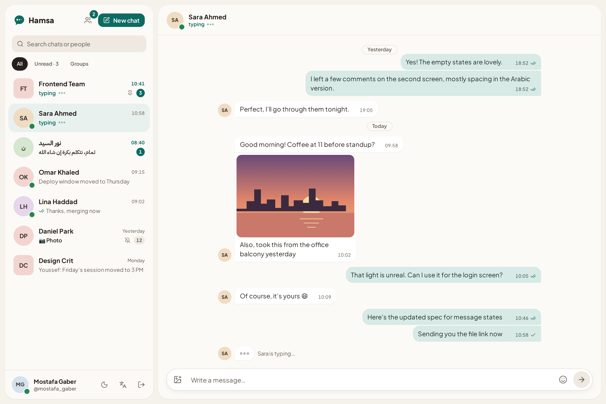
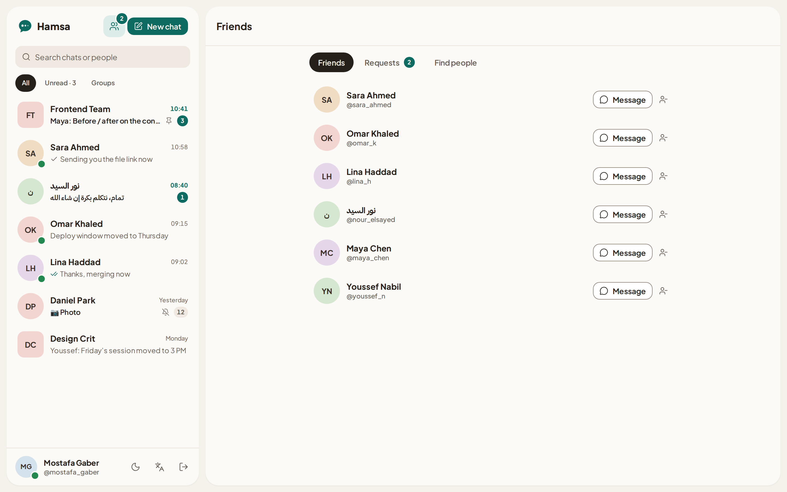
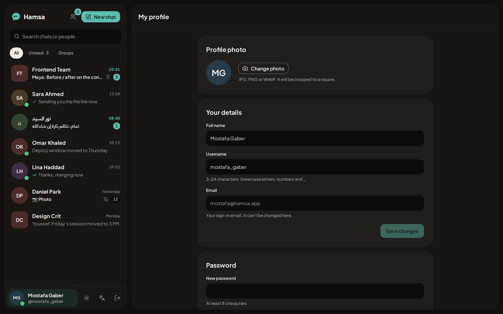
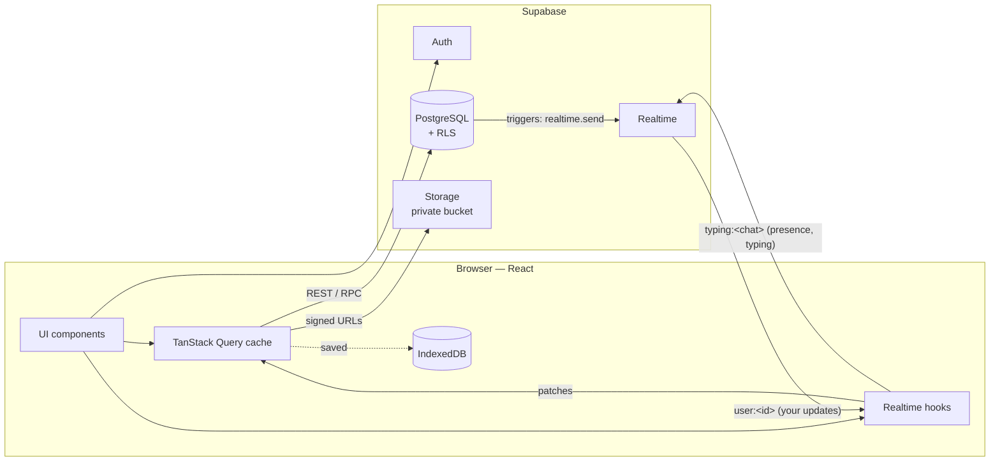

<div align="center">


# Hamsa · همسة

**A real-time chat app that feels like a quiet room.**

🔗 **[hamsa-seven.vercel.app](https://hamsa-seven.vercel.app)**

Live messaging, voice notes, files, photos and video, stickers, typing indicators, online presence,
read receipts, friends and groups —
fully bilingual (English / Arabic with real RTL), in light and dark themes.

[**Live demo**](https://hamsa-seven.vercel.app) · [Design system](https://claude.ai/artifact/6tYWvRDFXbqZE5QsoW8Sfz) · [Report a bug](https://github.com/MostafaGaber135/Hamsa/issues)


</div>

<!-- Add your screenshots to docs/screenshots/ with these names, or change the paths. -->
<p align="center">
  
</p>
<p align="center">
  
  
</p>

---

## Features

**Messaging**
- Real-time messages, no refresh — sent optimistically, then confirmed by the server
- Delivery states you can read at a glance: sending, sent, read, failed with one-click retry
- Read receipts and unread counts that update live
- Voice notes with a live waveform while recording, saved with the message for playback
- Photos and videos, documents (PDFs open in the browser) and your current location —
  with a preview before sending, drag-and-drop and paste
- A full-screen viewer for photos, videos and PDFs, with next / previous and download
- Hamsa's own sticker pack, an emoji picker, per-conversation drafts, and an unread count in the browser tab
- Chat info panel: shared media, files, voice notes and links, plus a per-chat wallpaper (9 designs, light and dark)
- Smart scrolling: follows new messages when you're at the bottom, shows a "new messages" button when you're reading history, and loads older messages as you scroll up
- A menu on every message (right-click, long press, or the ⋯ button): reply, react, copy, edit (15 minutes), delete for everyone (a day), pin, save, message info, report
- Replies quote the original (click to jump to it); one reaction per person, shown under the bubble
- Clickable links with a text preview (title and description, fetched by the server; no third-party images)
- @mentions in groups, which notify even when the group is muted
- Search every message you can read, English and Arabic alike, and jump to the result
- Pinned messages at the top of a chat (admins in groups), and saved messages in the chat info
- "Read by" for your messages in groups
- Several photos or files at once, with upload progress and cancel; voice notes at 1×, 1.5× or 2×
- Drafts kept per chat, even after closing Hamsa
- One-to-one voice and video calls (WebRTC)

**Presence**
- Online status and "last seen", visible only to people you chat with — or to nobody, if you choose
- Push notifications for new messages, even when Hamsa is closed (Web Push, installable as an app)
- "Sara is typing…" in the chat, the header and the conversation list

**People**
- One-to-one chats and groups, with group photo and name, admins, and adding or removing members
- Friends: search people, send, accept, decline and cancel requests
- Block people from a chat's info panel: they can't message you, start a chat or send a friend request; unblock any time from your profile
- Choose who can add you to groups: everyone, or only your friends
- Message requests: a chat a stranger starts waits in its own tab, without notifications or read receipts, until you accept, reply, delete or block
- Delete your account from your profile, permanently
- Conversation menu: pin, mute, mark as read / unread, delete chat (for you only), leave group — via the ⋯ button, right-click, or Shift + F10

**Account**
- Email + password and Google sign-in (one button signs up *and* signs in)
- Email verification and "forgot password", both with a 6-digit code (a link works too)
- Profile page: name, username with a live availability check, photo upload (cropped and resized in the browser), password change
- Google profile photo imported automatically

**Experience**
- English and Arabic, with the whole layout mirrored through logical CSS — no RTL-specific styles
- Light and dark themes built on design tokens
- Keyboard accessible throughout: one tab stop for the conversation list with arrow-key navigation, visible focus rings, accessible menus and dialogs
- Responsive: three-pane desktop layout, two-screen mobile flow
- Respects `prefers-reduced-motion`
- A "Reconnecting…" banner when the connection drops, then catches up on anything missed
- Real URLs (`/c/<chat>`, `/friends`, `/profile`): the Back button, including Android's, steps back through screens instead of leaving the app
- Installable app that opens offline, with an update prompt when a new version is ready
- An outbox: messages sent while offline wait and go out as soon as you're back (text messages even if you close Hamsa)
- Unread count on the installed app's icon, "Share to Hamsa" from your phone's gallery, and "Mark as read" / "Reply" on notifications
- A public home page with link previews (Open Graph) for sharing

---

## Tech stack

| | |
|---|---|
| **Frontend** | React 19, TypeScript, Vite |
| **Styling** | Tailwind CSS v4 with CSS-variable design tokens, Lucide icons |
| **Server state** | TanStack Query (caching, infinite queries, optimistic updates), saved to IndexedDB |
| **Backend** | Supabase: PostgreSQL, Auth, Storage, Realtime |
| **Realtime** | Broadcast from Database (one private channel per person), Presence (online) and Broadcast (typing) per conversation |
| **Security** | Row Level Security on every table, private Realtime channels, private storage |
| **Hosting** | Vercel (frontend), Supabase (backend, EU region) |

---

## Architecture



The UI reads everything through TanStack Query. Realtime events don't trigger refetches: they patch
the cache directly (a new message is inserted into the right page, a read receipt updates one member),
so the screen updates instantly with no extra requests.

**Live updates scale with people, not tables.** Database triggers send each change only to the people it
concerns, on their own private channel `user:<id>` (Broadcast from Database). Nothing listens to whole
tables, so the server never checks every new row against every connected user, and a new message no longer
makes every member reload their chat list. Typing and online status use one channel per conversation, for
your 50 most recent chats.

**Fast start, small download.** The cache is saved to IndexedDB (never messages still sending, wiped at
sign-out or when another account signs in), so Hamsa opens on your chats and then refreshes. Each screen
and panel (sign-in, profile, friends, chat info, the media viewer, the emoji picker) is its own chunk,
loaded on first use. Long histories stay smooth: older messages are skipped by the browser while off screen.

---

## Security

All access rules live in the database, not in the frontend, so they hold even if someone calls the API directly.

- **Row Level Security on every table.** You can only read conversations you're a member of, and only send messages as yourself. One `is_member()` function guards messages, participants and image files.
- **No recursive policies.** `is_member()` is `security definer`, which avoids the classic infinite-recursion bug when a membership table's policy checks membership.
- **Multi-table writes go through functions.** Creating a conversation and adding its members happens in one transaction.
- **Column-level privileges.** On your own profile you can edit only your name, username and photo — never your id or timestamps.
- **The server owns time.** A trigger sets `created_at`, so messages can't be back-dated.
- **Attachments are validated twice.** The database rejects attachments with the wrong types, a location without valid coordinates, or more than 4 KB of JSON. The app also checks every field it reads, and each message renders inside its own error boundary, so one bad message can never blank out a chat.
- **Private Realtime channels.** Each conversation's channel (`typing:<conversation-id>`) carries typing and online status, and policies on `realtime.messages` let only its members in — never a one-to-one chat where either person blocked the other. There is no channel where everyone sees everyone.
- **"Last seen" is not a public column.** Column privileges hide `last_seen_at`; it's only handed out through a function that checks you share a chat, it isn't hidden, nobody blocked anyone, and it isn't an unaccepted message request.
- **Rate limit.** A trigger refuses more than 15 messages per person in 10 seconds.
- **Nothing left behind.** Files whose message was never saved, or whose chat is gone, and replaced photos are deleted by a scheduled Edge Function. Deleting an account deletes the profile, messages, one-to-one chats, friendships and devices; groups get a new admin if needed.
- **Private file storage.** Chat images, voice notes and documents are only reachable through short-lived signed URLs, and only members can upload to a conversation's folder.
- **Admin-only group changes.** Renaming, the group photo and membership changes are checked in the database, not just hidden in the UI. A group can never lose its last admin.
- **Edits, deletions, pins and reactions go through functions** that check who you are, the time limits and admin rights; the server works out @mentions itself, and a reply can only quote a message from the same chat.
- **Reports can't be read from the app.** They're kept, with the reported text, for whoever runs Hamsa to review in the dashboard.
- **Link previews never reveal readers.** The page is fetched by an Edge Function (public web addresses only), cached, and shown as text.
- **Calls are peer to peer.** Audio and video go directly between the two browsers, encrypted by WebRTC; only the signalling uses the chat's private channel.
- **Blocking is enforced by the database.** The messages policy refuses writes into a blocked one-to-one chat, and new chats, friend requests and group invites check blocks and each person's group setting. Nobody can look up who blocked whom.
- **Photos only from Hamsa's storage.** A profile or group photo must be a file in your own folder of this project's avatars bucket (or your Google photo), so nobody can plant a tracking image that logs who looked at it.
- **Security headers.** `vercel.json` sets `nosniff`, `X-Frame-Options`, `Referrer-Policy`, `Permissions-Policy` and HSTS, plus a Content Security Policy (currently in report-only mode).

The security rules are covered by SQL tests in [`supabase/tests`](supabase/tests): outsiders can't read or write a conversation, nobody can impersonate another user, uploads are limited to members, and malformed attachments are refused.

---

## Engineering decisions

**Client-generated message ids.** Each message gets its id from `crypto.randomUUID()` in the browser. When Realtime echoes your own insert back, it's matched by id and merged instead of appearing twice — and a retry after a network error can never create a duplicate.

**Read receipts from one timestamp.** Each member has a single `last_read_at` per conversation. Unread count = messages after mine; "read" = every other member's `last_read_at` has passed the message. One update per conversation opened, instead of one row per message.

**One row per friendship.** A unique index on the sorted pair of user ids means A→B and B→A can't both exist. If B sends a request while A's is pending, it becomes an acceptance.

**Per-person conversation settings.** Pin, mute, "mark as unread" and "delete chat" are stored on your participant row, so they never affect anyone else. "Mark as unread" is a flag rather than a change to `last_read_at`, so other people's read receipts stay correct.

**Bubble shape vs. content direction.** A bubble's corners follow the interface direction; its text uses `dir="auto"`. An English message in the Arabic interface keeps its own direction and its timestamp on the correct side.

**Images resized before upload.** A multi-megabyte phone photo is scaled in the browser (to 1600 px for messages, 256 px for avatars) before it's sent.

**One message table, many kinds.** Text, photos, video, voice, files, location and stickers share one `messages` table: a `kind` column and a small `attachment` JSON (path, name, size, duration, coordinates). New kinds need no new tables, and Realtime delivers them all the same way.

**Notifications without a server.** A database webhook calls an Edge Function on every new message;
it looks up the recipients (skipping the sender and anyone who muted the chat), sends Web Push, and
forgets browsers that have unsubscribed. The service worker skips the pop-up when Hamsa is already open
and focused, and clicking a notification opens that exact chat.

**Text direction per message and per keystroke.** The composer sets `dir` from the first letter you type instead of using `unicode-bidi: plaintext`, which puts the caret on the wrong side on mobile browsers.

---

## Getting started

### 1. Create a Supabase project

Create a free project at [supabase.com](https://supabase.com), then create the database, either way:

- **With the Supabase CLI** (recommended): `npx supabase login`, `npx supabase link --project-ref <your-project-ref>`,
  then `npm run db:push`. It applies [`supabase/migrations`](supabase/migrations) in order, and later only the new ones.
- **By hand**: in **SQL Editor → New query**, paste and run [`supabase/schema.sql`](supabase/schema.sql) once.
  It's all the migrations in one file, generated from them (`npm run db:schema`), so the two never differ.

### 2. Configure environment variables

```bash
cp .env.example .env.local
```

Fill in the values from **Project Settings → API** (or the **Connect** button):

```env
VITE_SUPABASE_URL=https://your-project-id.supabase.co
VITE_SUPABASE_PUBLISHABLE_KEY=sb_publishable_...
```

The publishable key is safe in the browser — Row Level Security is what protects the data.

### 3. Run it

```bash
npm install
npm run dev
```

Open <http://localhost:5173>. To try a conversation, sign up two accounts, one in a normal window and one in a private window.

### Deploy

The app is a static Vite build, deployed on Vercel. Add the same two `VITE_…` variables in
**Vercel → Project → Settings → Environment Variables**. [`vercel.json`](vercel.json) sends every path
to `index.html`, so pages like `/c/<chat>` and `/privacy` work on refresh, and sets the security headers.

Also worth setting:

- `VITE_SITE_URL` (e.g. `https://hamsa-seven.vercel.app`): absolute links for link previews.
- **Analytics → Enable** and **Speed Insights → Enable** in the Vercel project: anonymous page views and
  loading speed (chat ids are removed from URLs before they're sent).
- `VITE_SENTRY_DSN` (optional): error reports to [Sentry](https://sentry.io). Without it, Sentry isn't even downloaded.

> For quick local testing, you can turn off **Authentication → Sign In / Providers → Email → Confirm email**.

### Email verification and password reset (optional)

Supabase's built-in email only sends to your own team, so real users need your own SMTP:

1. **Authentication → Emails → SMTP Settings**: turn on custom SMTP. With Gmail, create an
   [App Password](https://myaccount.google.com/apppasswords) and use host `smtp.gmail.com`, port `465`,
   your Gmail address as the username and sender, and the app password.
2. **Authentication → Emails → Templates**: paste
   [`confirm-signup.html`](supabase/email-templates/confirm-signup.html) into *Confirm signup* and
   [`reset-password.html`](supabase/email-templates/reset-password.html) into *Reset password*.
3. **Authentication → Sign In / Providers → Email**: turn **Confirm email** on.

### Edge Functions

The functions share code in [`supabase/functions/_shared`](supabase/functions/_shared), so they're deployed
with the Supabase CLI, not pasted into the Dashboard editor. After `npx supabase link` (step 1):

```bash
npm run functions:deploy
```

This deploys all five with **Verify JWT** off, as set in [`supabase/config.toml`](supabase/config.toml): each
checks its own secret or the caller's token. A function whose required secret is missing answers with an error
naming it. Run it again after adding a secret or changing a function.

### Push notifications (optional)

1. Generate keys: `npx web-push generate-vapid-keys`.
2. Add `VITE_VAPID_PUBLIC_KEY=<public key>` to `.env.local` and to Vercel.
3. Deploy the functions (see [Edge Functions](#edge-functions)).
4. **Edge Functions → Secrets**: add `VAPID_PUBLIC_KEY`, `VAPID_PRIVATE_KEY`,
   `VAPID_SUBJECT` (`mailto:you@example.com`) and `WEBHOOK_SECRET` (any long random string).
5. **Database → Webhooks → Create**: table `messages`, event *Insert*, type *Supabase Edge Functions*,
   function `send-push`, and an HTTP header `x-webhook-secret` with the same secret.
6. In Hamsa: **My profile → Notifications → Turn on**. On iPhone, first *Share → Add to Home Screen*.
7. Optional, the **Mark as read** button on notifications: add an `ACTION_SECRET` secret (any long random
   string). `send-push` picks it up on its next start; `notification-action` needs it to work.

### Link previews

Needs only the deployed functions (see [Edge Functions](#edge-functions)); `link-preview` checks the caller's token
itself. Without it, links are still clickable, just without a preview.

### Account deletion

Needs only the deployed functions (see [Edge Functions](#edge-functions)); `delete-account` checks the caller's
token itself.

### Storage clean-up (optional)

1. Deploy the functions (see [Edge Functions](#edge-functions)).
2. **Edge Functions → Secrets**: add `CRON_SECRET` (any long random string).
3. **Integrations → Cron** (enable `pg_cron` and `pg_net` if asked) → **Create job**: daily (`0 3 * * *`),
   type *Supabase Edge Function*, function `cleanup-storage`, method POST, header `x-cron-secret` with the same secret.

### Google sign-in (optional)

1. In Google Cloud Console → **Google Auth Platform**, create a **Web application** client.
2. Add `http://localhost:5173` to *Authorized JavaScript origins*, and `https://<your-project-id>.supabase.co/auth/v1/callback` to *Authorized redirect URIs*.
3. In Supabase → **Authentication → Sign In / Providers → Google**, enable it and paste the client ID and secret.
4. In **Authentication → URL Configuration**, set the Site URL and add your app's URL to Redirect URLs.

---

## Project structure

```
src/
├── components/           Update prompt, crash screen; ui/: Button, Avatar, Badge, Menu, Link, TextField…
├── features/
│   ├── auth/             Login and sign-up, session
│   ├── calls/            Voice and video calls (WebRTC)
│   ├── chat/             The signed-in app shell
│   ├── conversations/    Sidebar, conversation list and menu, new chat dialog
│   ├── messages/         Thread, message bubble, composer, emoji and sticker picker, voice recorder
│   ├── friends/          Friends, requests, people search
│   ├── landing/          The public home page
│   ├── share/            "Share to Hamsa" from other apps
│   ├── profile/          Profile editing
│   ├── privacy/          Blocking people, who can add you to groups
│   ├── realtime/         Live updates, presence, typing
│   └── legal/            Privacy policy
├── lib/                  Supabase client, router, i18n (en.ts, ar.ts loaded on demand), theme, cache, monitoring
├── sw.ts                 Service worker: offline app shell, push, notification buttons, share target
├── styles/               Design tokens and the Tailwind theme
└── types/                App types and generated database types
supabase/
├── config.toml           Local Supabase (npm run db:start)
├── schema.sql            The complete database in one file, generated from the migrations
├── functions/            Edge Functions: send-push, notification-action, link-preview, delete-account, cleanup-storage;
│                         _shared/: secrets, admin client, CORS, signed action tokens
├── email-templates/      Verification and reset emails with the 6-digit code
├── migrations/           The same schema, step by step
└── tests/                SQL tests for the security rules
e2e/                      Playwright: two browsers, one conversation
scripts/                  Schema build, SQL test runner, e2e runner, Tailwind class check
.github/workflows/ci.yml  CI
```

Each feature keeps its own `api.ts` (Supabase calls), `queries.ts` (TanStack Query hooks) and components together.

---

## Development

| Command | What it does |
|---|---|
| `npm run dev` | The app, on <http://localhost:5173> |
| `npm run format` · `npm run format:check` | Prettier (with Tailwind class sorting): fix, or only check |
| `npm run lint` · `npm run typecheck` | oxlint · TypeScript (app, service worker, config) |
| `npm run lint:tailwind` | Every Tailwind class in its canonical form (`node scripts/check-tailwind.mjs --fix` rewrites them) |
| `npm run lint:unused` | knip: unused files, exports and dependencies |
| `npm run typecheck:functions` | Deno type-check of the Edge Functions |
| `npm test` | Unit tests (Vitest): data validation, routing, message status, text direction, previews |
| `npm run test:db` | The SQL tests on a fresh database with `schema.sql` (needs `psql`, or `PSQL="docker exec -i <container> psql -U postgres"`) |
| `npm run db:start` | A local Supabase in Docker, with every migration applied |
| `npm run test:e2e` | Playwright against the local Supabase: two people sign up, one writes, the other sees it live and replies |
| `npm run db:schema` | Rebuild `supabase/schema.sql` after changing or adding a migration |
| `npm run db:types` | Regenerate `src/types/database.generated.ts` from the local database |
| `npm run db:push` | Apply new migrations to the linked Supabase project |
| `npm run functions:deploy` | Deploy every Edge Function to the linked Supabase project |

On every commit, a pre-commit hook (simple-git-hooks + lint-staged, set up by `npm install`) formats the
staged files and lints the staged TypeScript.

**CI** ([`.github/workflows/ci.yml`](.github/workflows/ci.yml)) runs on every pull request: formatting, lint, Tailwind classes,
unused code, types (app and Edge Functions), unit tests and the build; the SQL tests (and a check that `schema.sql` matches the migrations); then, against a local
Supabase with every migration applied, a check that the generated types are current and the end-to-end test.

---

## Roadmap

- [ ] Group calls, and a TURN relay so calls connect on every network
- [ ] Photo albums (several photos in one message)

---

## Author

**Mostafa Gaber** — Frontend Developer

[Portfolio](https://mostafagaberahmed.site) · [LinkedIn](https://linkedin.com/in/mostafagaber135) · [GitHub](https://github.com/MostafaGaber135)
