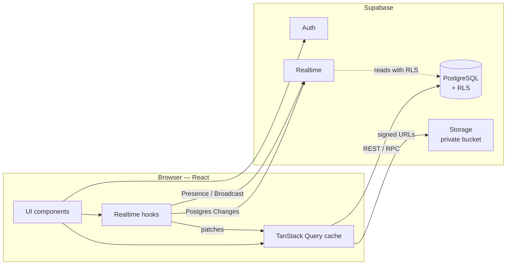

<div align="center">


# Hamsa · همسة

**A real-time chat app that feels like a quiet room.**

🔗 **[hamsa-seven.vercel.app](https://hamsa-seven.vercel.app)**

Live messaging, voice notes, files, photos and video, stickers, typing indicators, online presence,
read receipts, friends and groups —
fully bilingual (English / Arabic with real RTL), in light and dark themes.

[**Live demo**](https://hamsa-seven.vercel.app) · [Design system](https://claude.ai/artifact/6tYWvRDFXbqZE5QsoW8Sfz) · [Report a bug](https://github.com/MostafaGaber135/Hamsa/issues)


</div>

<!-- Add your screenshots to docs/screenshots/ with these names, or change the paths. -->
<p align="center">
  
</p>
<p align="center">
  
  
</p>

---

## Features

**Messaging**
- Real-time messages, no refresh — sent optimistically, then confirmed by the server
- Delivery states you can read at a glance: sending, sent, read, failed with one-click retry
- Read receipts and unread counts that update live
- Voice notes with a live waveform while recording, saved with the message for playback
- Photos and videos, documents (PDFs open in the browser) and your current location —
  with a preview before sending, drag-and-drop and paste
- A full-screen viewer for photos, videos and PDFs, with next / previous and download
- Hamsa's own sticker pack, an emoji picker, per-conversation drafts, and an unread count in the browser tab
- Chat info panel: shared media, files, voice notes and links, plus a per-chat wallpaper (9 designs, light and dark)
- Smart scrolling: follows new messages when you're at the bottom, shows a "new messages" button when you're reading history, and loads older messages as you scroll up

**Presence**
- Online status and "last seen"
- Push notifications for new messages, even when Hamsa is closed (Web Push, installable as an app)
- "Sara is typing…" in the chat, the header and the conversation list

**People**
- One-to-one chats and groups, with group photo and name, admins, and adding or removing members
- Friends: search people, send, accept, decline and cancel requests
- Conversation menu: pin, mute, mark as read / unread, delete chat (for you only), leave group — via the ⋯ button, right-click, or Shift + F10

**Account**
- Email + password and Google sign-in (one button signs up *and* signs in)
- Email verification and "forgot password", both with a 6-digit code (a link works too)
- Profile page: name, username with a live availability check, photo upload (cropped and resized in the browser), password change
- Google profile photo imported automatically

**Experience**
- English and Arabic, with the whole layout mirrored through logical CSS — no RTL-specific styles
- Light and dark themes built on design tokens
- Keyboard accessible throughout: one tab stop for the conversation list with arrow-key navigation, visible focus rings, accessible menus and dialogs
- Responsive: three-pane desktop layout, two-screen mobile flow
- Respects `prefers-reduced-motion`
- A "Reconnecting…" banner when the connection drops, then catches up on anything missed

---

## Tech stack

| | |
|---|---|
| **Frontend** | React 19, TypeScript, Vite |
| **Styling** | Tailwind CSS v4 with CSS-variable design tokens, Lucide icons |
| **Server state** | TanStack Query (caching, infinite queries, optimistic updates) |
| **Backend** | Supabase: PostgreSQL, Auth, Storage, Realtime |
| **Realtime** | Postgres Changes (messages, receipts), Presence (online), Broadcast (typing) |
| **Security** | Row Level Security on every table, private Realtime channels, private storage |
| **Hosting** | Vercel (frontend), Supabase (backend, EU region) |

---

## Architecture



The UI reads everything through TanStack Query. Realtime events don't trigger refetches: they patch
the cache directly (a new message is inserted into the right page, a read receipt updates one member),
so the screen updates instantly with no extra requests.

---

## Security

All access rules live in the database, not in the frontend, so they hold even if someone calls the API directly.

- **Row Level Security on every table.** You can only read conversations you're a member of, and only send messages as yourself. One `is_member()` function guards messages, participants and image files.
- **No recursive policies.** `is_member()` is `security definer`, which avoids the classic infinite-recursion bug when a membership table's policy checks membership.
- **Multi-table writes go through functions.** Creating a conversation and adding its members happens in one transaction.
- **Column-level privileges.** On your own profile you can edit only your name, username and photo — never your id or timestamps.
- **The server owns time.** A trigger sets `created_at`, so messages can't be back-dated.
- **Private Realtime channels.** Typing channels (`typing:<conversation-id>`) are restricted to that conversation's members by policies on `realtime.messages`.
- **Private file storage.** Chat images, voice notes and documents are only reachable through short-lived signed URLs, and only members can upload to a conversation's folder.
- **Admin-only group changes.** Renaming, the group photo and membership changes are checked in the database, not just hidden in the UI.

The security rules are covered by SQL tests in [`supabase/tests`](supabase/tests): outsiders can't read or write a conversation, nobody can impersonate another user, and uploads are limited to members.

---

## Engineering decisions

**Client-generated message ids.** Each message gets its id from `crypto.randomUUID()` in the browser. When Realtime echoes your own insert back, it's matched by id and merged instead of appearing twice — and a retry after a network error can never create a duplicate.

**Read receipts from one timestamp.** Each member has a single `last_read_at` per conversation. Unread count = messages after mine; "read" = every other member's `last_read_at` has passed the message. One update per conversation opened, instead of one row per message.

**One row per friendship.** A unique index on the sorted pair of user ids means A→B and B→A can't both exist. If B sends a request while A's is pending, it becomes an acceptance.

**Per-person conversation settings.** Pin, mute, "mark as unread" and "delete chat" are stored on your participant row, so they never affect anyone else. "Mark as unread" is a flag rather than a change to `last_read_at`, so other people's read receipts stay correct.

**Bubble shape vs. content direction.** A bubble's corners follow the interface direction; its text uses `dir="auto"`. An English message in the Arabic interface keeps its own direction and its timestamp on the correct side.

**Images resized before upload.** A multi-megabyte phone photo is scaled in the browser (to 1600 px for messages, 256 px for avatars) before it's sent.

**One message table, many kinds.** Text, photos, video, voice, files, location and stickers share one `messages` table: a `kind` column and a small `attachment` JSON (path, name, size, duration, coordinates). New kinds need no new tables, and Realtime delivers them all the same way.

**Notifications without a server.** A database webhook calls an Edge Function on every new message;
it looks up the recipients (skipping the sender and anyone who muted the chat), sends Web Push, and
forgets browsers that have unsubscribed. The service worker skips the pop-up when Hamsa is already open
and focused, and clicking a notification opens that exact chat.

**Text direction per message and per keystroke.** The composer sets `dir` from the first letter you type instead of using `unicode-bidi: plaintext`, which puts the caret on the wrong side on mobile browsers.

---

## Getting started

### 1. Create a Supabase project

Create a free project at [supabase.com](https://supabase.com). In **SQL Editor → New query**, paste and run
[`supabase/schema.sql`](supabase/schema.sql) once. It creates every table, policy, function, storage bucket and Realtime rule.

> The same schema is also split into step-by-step files in [`supabase/migrations`](supabase/migrations), in the order it was built.

### 2. Configure environment variables

```bash
cp .env.example .env.local
```

Fill in the values from **Project Settings → API** (or the **Connect** button):

```env
VITE_SUPABASE_URL=https://your-project-id.supabase.co
VITE_SUPABASE_PUBLISHABLE_KEY=sb_publishable_...
```

The publishable key is safe in the browser — Row Level Security is what protects the data.

### 3. Run it

```bash
npm install
npm run dev
```

Open <http://localhost:5173>. To try a conversation, sign up two accounts, one in a normal window and one in a private window.

### Deploy

The app is a static Vite build, deployed on Vercel. Add the same two `VITE_…` variables in
**Vercel → Project → Settings → Environment Variables**. [`vercel.json`](vercel.json) sends every path
to `index.html`, so pages like `/privacy` work on refresh.

> For quick local testing, you can turn off **Authentication → Sign In / Providers → Email → Confirm email**.

### Email verification and password reset (optional)

Supabase's built-in email only sends to your own team, so real users need your own SMTP:

1. **Authentication → Emails → SMTP Settings**: turn on custom SMTP. With Gmail, create an
   [App Password](https://myaccount.google.com/apppasswords) and use host `smtp.gmail.com`, port `465`,
   your Gmail address as the username and sender, and the app password.
2. **Authentication → Emails → Templates**: paste
   [`confirm-signup.html`](supabase/email-templates/confirm-signup.html) into *Confirm signup* and
   [`reset-password.html`](supabase/email-templates/reset-password.html) into *Reset password*.
3. **Authentication → Sign In / Providers → Email**: turn **Confirm email** on.

### Push notifications (optional)

1. Generate keys: `npx web-push generate-vapid-keys`.
2. Add `VITE_VAPID_PUBLIC_KEY=<public key>` to `.env.local` and to Vercel.
3. **Edge Functions → Deploy a new function → Via editor**: name it `send-push`, paste
   [`supabase/functions/send-push/index.ts`](supabase/functions/send-push/index.ts), deploy, and turn
   **Verify JWT** off in its settings (it checks its own secret instead).
4. **Edge Functions → Secrets**: add `VAPID_PUBLIC_KEY`, `VAPID_PRIVATE_KEY`,
   `VAPID_SUBJECT` (`mailto:you@example.com`) and `WEBHOOK_SECRET` (any long random string).
5. **Database → Webhooks → Create**: table `messages`, event *Insert*, type *Supabase Edge Functions*,
   function `send-push`, and an HTTP header `x-webhook-secret` with the same secret.
6. In Hamsa: **My profile → Notifications → Turn on**. On iPhone, first *Share → Add to Home Screen*.

### Google sign-in (optional)

1. In Google Cloud Console → **Google Auth Platform**, create a **Web application** client.
2. Add `http://localhost:5173` to *Authorized JavaScript origins*, and `https://<your-project-id>.supabase.co/auth/v1/callback` to *Authorized redirect URIs*.
3. In Supabase → **Authentication → Sign In / Providers → Google**, enable it and paste the client ID and secret.
4. In **Authentication → URL Configuration**, set the Site URL and add your app's URL to Redirect URLs.

---

## Project structure

```
src/
├── components/ui/        Button, Avatar, Badge, Menu, TextField, Spinner…
├── features/
│   ├── auth/             Login and sign-up, session
│   ├── chat/             The signed-in app shell
│   ├── conversations/    Sidebar, conversation list and menu, new chat dialog
│   ├── messages/         Thread, message bubble, composer, emoji picker
│   ├── friends/          Friends, requests, people search
│   ├── profile/          Profile editing
│   ├── realtime/         Live updates, presence, typing
│   └── legal/            Privacy policy
├── lib/                  Supabase client, i18n and dates, theme, image resizing
├── styles/               Design tokens and the Tailwind theme
└── types/                App types and generated database types
supabase/
├── schema.sql            The complete database in one file
├── functions/send-push/  Edge Function that sends push notifications
├── email-templates/      Verification and reset emails with the 6-digit code
├── migrations/           The same schema, step by step
└── tests/                SQL tests for the security rules
```

Each feature keeps its own `api.ts` (Supabase calls), `queries.ts` (TanStack Query hooks) and components together.

---

## Roadmap

- [ ] Unit tests (Vitest) and end-to-end tests (Playwright) in CI
- [ ] Message reactions and replies

---

## Author

**Mostafa Gaber** — Frontend Developer

[Portfolio](https://mostafagaberahmed.site) · [LinkedIn](https://linkedin.com/in/mostafagaber135) · [GitHub](https://github.com/MostafaGaber135)
